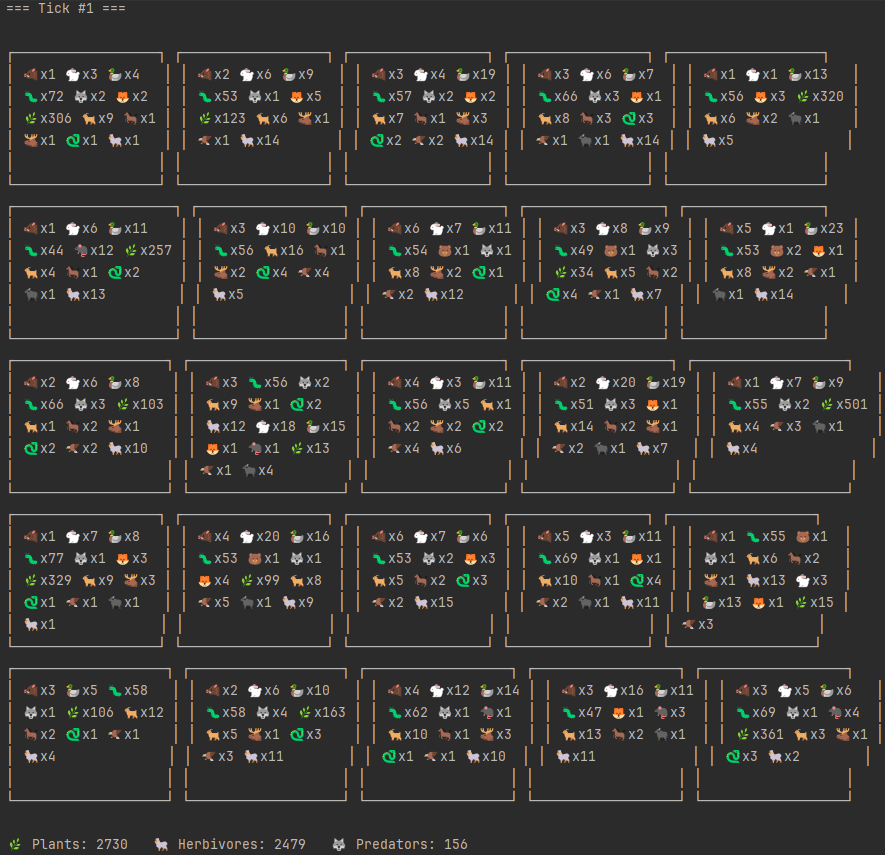

# Island Simulation 🌴🐾

A console-based simulation of an island ecosystem implemented in Java.
The island is represented as a grid (e.g., 100x20 cells), where each location may contain plants and animals.

Animals interact with the environment and each other by:

Eating plants or other animals (if food is available in their location).

Moving to neighboring locations.

Reproducing (if a partner is present in their location).

Dying of hunger or being eaten.

This project demonstrates Object-Oriented Programming (OOP) principles by modeling diverse species through inheritance and polymorphism.

## How It Works

- Each animal type inherits from the abstract class Animal.
- Common behaviors (eating, moving, reproducing, dying) are defined in Animal.
- Specific species override methods to implement unique behavior.
- The simulation runs in console output, printing the state of the island step by step.

## Features

- 🌱 Vegetation growth — plants repopulate over time.
- 🐇 Animal diversity — predators, herbivores, and omnivores.
- 🔄 Ecosystem dynamics — eating, moving, breeding, and dying.
- 🧩 OOP structure — clear inheritance hierarchy and polymorphism.
- 📊 Console visualization — island state is displayed directly in the terminal.

## Screenshots


## How to Run

1. Clone this repository:
  ```bash
  git clone https://github.com/Nabuchodon0ssor/Island.git 
```
2. Open the project in your favorite Java IDE (e.g., IntelliJ IDEA or Eclipse).
3. Make sure you have:
  ```bash
  Java 17+
  Maven enabled (IDE will detect pom.xml)
```
4. Run the Main.java file:
  ```bash
  File location: src/main/java/com/game/island/Main.java
  Or use the IDE’s “Run” button.
